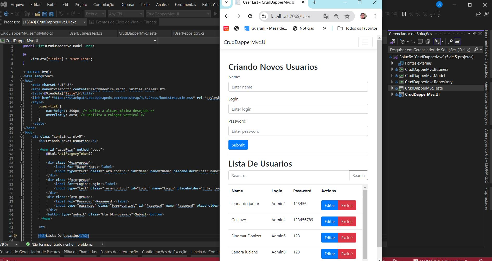

<h1>Aplicação de CRUD MVC com Dapper, JavaScript, CSS, HTML, Bootstrap, Injeção de Dependência e Controle, Testes Unitários</h1>
<h2>Descrição</h2>
Este projeto segue a arquitetura MVC (Model-View-Controller) e consiste em uma aplicação de CRUD desenvolvida utilizando Dapper, uma biblioteca de mapeamento objeto-relacional para .NET. A comunicação entre o frontend e o backend é realizada através do controle, onde as requisições são tratadas e as respostas são enviadas para as views. A aplicação é construída principalmente em JavaScript, CSS e HTML, com o uso do Bootstrap para criar uma interface de usuário responsiva e atraente. Além disso, são aplicados os princípios de injeção de dependência e controle para desacoplar componentes e garantir a modularidade do sistema. Testes unitários são implementados para garantir a qualidade e robustez do código.
<h2>Funcionalidades</h2>
- Criação, leitura, atualização e exclusão de dados.
- Interface de usuário moderna e responsiva, desenvolvida com HTML, CSS e Bootstrap.
- Injeção de dependência e controle para facilitar a modularidade do sistema.
- Testes unitários para garantir a qualidade do código.
<h2>Tecnologias Utilizadas</h2>
- Dapper: Biblioteca de mapeamento objeto-relacional para .NET, utilizada para interagir com o banco de dados.
- JavaScript: Linguagem de programação utilizada para o desenvolvimento do frontend.
- HTML: Linguagem de marcação utilizada para estruturar o conteúdo da aplicação.
- CSS: Linguagem de estilo utilizada para estilizar a interface do usuário.
- Bootstrap: Framework CSS utilizado para criar uma interface de usuário moderna e responsiva.
- Injeção de Dependência e Controle: Princípios de design de software utilizados para desacoplar componentes e facilitar a modularidade do sistema.
- Testes Unitários: Implementados para garantir a qualidade e robustez do código.
<h2>Execução</h2>
- Clone este repositório para o seu ambiente local.
- Configure as conexões com o banco de dados no arquivo de configuração do projeto.
- Execute a aplicação.
- Utilize a interface web para realizar operações de CRUD.
